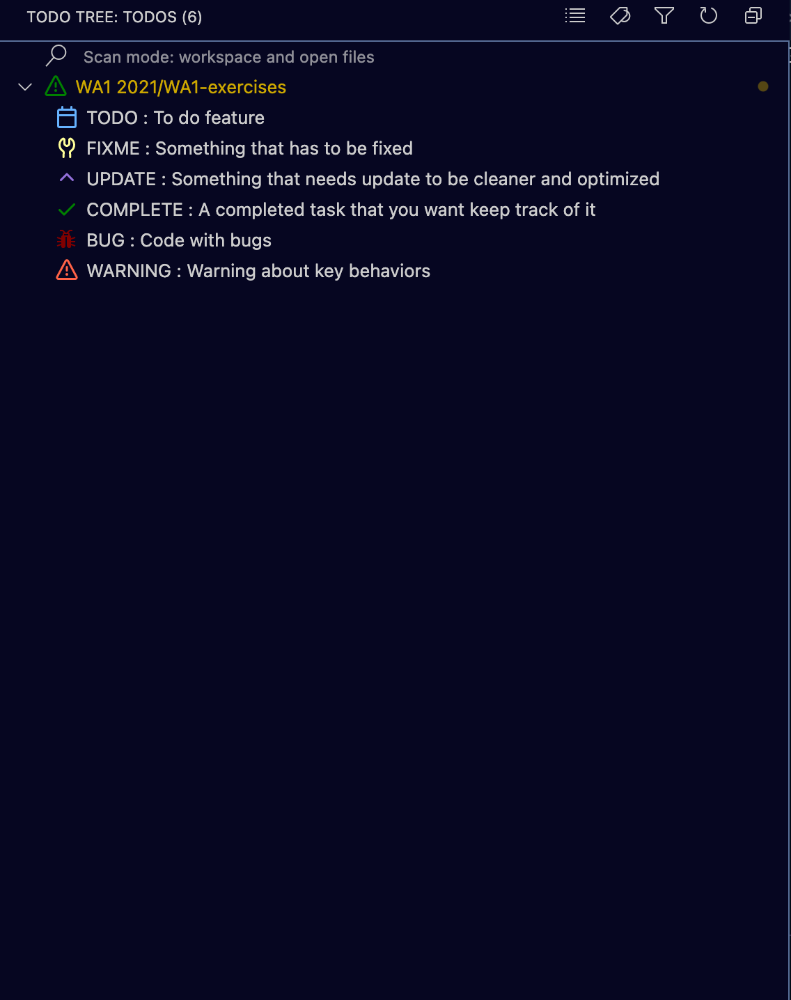

# Personal exercises of web application 1 course 
    In this repo we all have a folder for the javascript exercises
### Using TODO Tree
#### Configuration
0. Install TODO Tree extension to vs code
1. Press ctrl + shift + p and search for "Preferences: Open Settings (JSON)
2. Edit the file and append this text you can find [here](./settings.json) 
    * (you may need to add a ',' before the option)
    * once saved and correctly configured you should see a list of tags like this 

#### Conventions

    //#TODO: To do feature

    //#FIXME: Something that has to be fixed

    //#UPDATE: Something that needs update to be cleaner and optimized

    //#COMPLETE: A completed task that you want keep track of it

    //#BUG: Code with bugs
    
    //#WARNING : Warning about key behaviors

